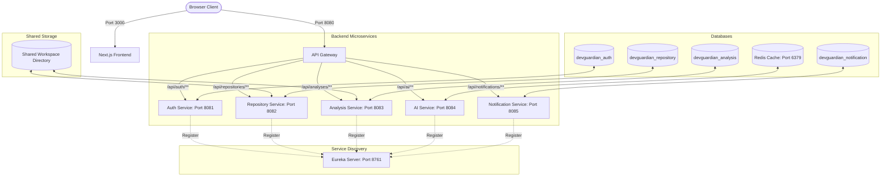
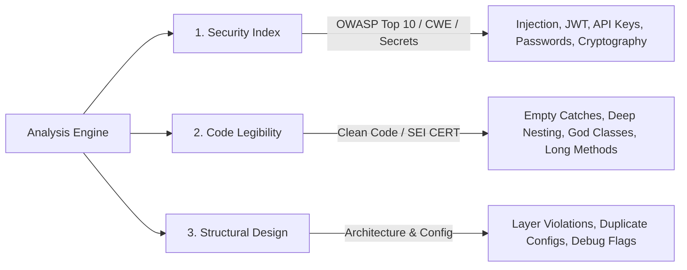

# DevGuardian - AI-Powered Code Security Cockpit

DevGuardian is a premium, state-of-the-art security analysis cockpit designed to automatically clone repositories, run static code analysis scans (for security, quality, and design vulnerabilities), and enrich detected issues with AI-generated explanations, impact analyses, and secure code mitigation templates.

---

## 🏗️ Architecture Overview

DevGuardian has been migrated from a legacy monolith into a modern, resilient **Spring Cloud Microservices Architecture** on the backend, paired with a dynamic **Next.js & TypeScript** frontend.



### 1. Backend Microservices
*   **Discovery Server (Eureka)** (`port 8761`): Central service registry where microservices register themselves on startup.
*   **API Gateway** (`port 8080`): The single entry point routing traffic from the client. Configured with a `DedupeResponseHeader` filter to prevent duplicate CORS headers from downstream services.
*   **Authentication Service** (`port 8081`): Manages user accounts, login validation, and generates secure JWT tokens.
*   **Repository Service** (`port 8082`): Interfaces with the GitHub API to list/import repositories and handles local git cloning via Eclipse JGit.
*   **Analysis Service** (`port 8083`): Executes static analysis rules on code files. Fires asynchronous scanning tasks via event listeners.
*   **AI Service** (`port 8084`): AI analyzer that consumes Groq and Gemini models to suggest explanations and patches for security findings. Integrates with **Redis** to cache response objects and avoid redundant LLM invocations.
*   **Notification Service** (`port 8085`): Manages user system notifications and unread badges.

### 2. Frontend Application
*   A premium React workspace built with **Next.js 16**, **TypeScript**, and styled with **Vanilla CSS** and customized theme variables.

---

## 🛡️ Security & Quality Rule Engine

DevGuardian features an extensible static analysis engine that evaluates source code and configuration files across **Security Standards (OWASP Top 10, CWE)**, **Clean Code Principles**, and **Software Architecture Best Practices**.

Findings are categorized into three core metrics:



### 1. 🔒 Security Index Rules (OWASP Top 10 & CWE)
Evaluates code against critical vulnerabilities, credential leaks, and insecure network transports.

| Rule Code | Rule Name | Security Standard / CWE | Severity | What It Detects |
| :--- | :--- | :--- | :--- | :--- |
| `SQL_INJECTION_RULE` | SQL Injection Detection | **OWASP A03:2021** (Injection)<br>**CWE-89** | `HIGH` | Dynamic SQL queries constructed via string concatenation / formatting instead of parameterized queries. |
| `COMMAND_INJECTION_RULE` | OS Command Injection | **OWASP A03:2021** (Injection)<br>**CWE-78** | `CRITICAL` | `Runtime.getRuntime().exec()` or `ProcessBuilder` invoked with unsanitized dynamic user parameters. |
| `XSS_RULE` | Cross-Site Scripting (XSS) | **OWASP A03:2021** (Injection)<br>**CWE-79** | `HIGH` | Unescaped HTML rendering, reflected inputs, or dangerous DOM assignments (`innerHTML`, `dangerouslySetInnerHTML`). |
| `PATH_TRAVERSAL_RULE` | Path Traversal | **OWASP A01:2021** (Broken Access Control)<br>**CWE-22** | `HIGH` | Unrestricted file system paths using `../` allowing arbitrary file reading or writing. |
| `HARDCODED_PASSWORD_RULE` | Hardcoded Password | **OWASP A07:2021** (Auth Failures)<br>**CWE-798**, **CWE-259** | `HIGH` | Plaintext passwords committed in code, `.properties`, or `.yaml` files. |
| `HARDCODED_SECRET_RULE` | Hardcoded Secret Detection | **OWASP A07:2021** (Auth Failures)<br>**CWE-798** | `CRITICAL` | Exposed JWT signing secrets, encryption keys, private tokens, and OAuth secrets in source or config. |
| `API_KEY_EXPOSURE_RULE` | API Key Exposure | **OWASP A07:2021** (Auth Failures)<br>**CWE-798** | `CRITICAL` | Leaked third-party credentials (Stripe `sk_live_`, Google `AIza`, GitHub `ghp_`, OpenAI `sk-`, SendGrid `SG.`, etc.). |
| `AWS_CREDENTIAL_RULE` | AWS Credential Detection | **OWASP A07:2021** (Auth Failures)<br>**CWE-798** | `CRITICAL` | Hardcoded AWS Access Key IDs (`AKIA...`, `ASIA...`) and 40-character secret keys. |
| `WEAK_JWT_SECRET_RULE` | Weak JWT Secret | **OWASP A02:2021** (Cryptographic Failures)<br>**CWE-326** | `HIGH` | Low-entropy, dictionary-based, or short (< 256-bit) HMAC signing secrets allowing offline token forgery. |
| `WEAK_CRYPTOGRAPHY_RULE` | Weak Cryptography | **OWASP A02:2021** (Cryptographic Failures)<br>**CWE-327**, **CWE-328** | `MEDIUM` | Broken or obsolete algorithms (MD5, SHA-1, DES, 3DES, RC4, or AES in insecure ECB mode). |
| `SENSITIVE_FILE_RULE` | Sensitive File Exposure | **OWASP A05:2021** (Misconfiguration)<br>**CWE-552** | `HIGH` | Committed `.pem`, `.key`, `.env`, keystore (`.jks`), or database dumps in version control. |
| `WILDCARD_CORS_RULE` | Overly Permissive CORS | **OWASP A05:2021** (Misconfiguration)<br>**CWE-942** | `MEDIUM` | Wildcard CORS origin (`*`) enabled alongside credential support (`allowCredentials = true`). |
| `INSECURE_HTTP_URL_RULE` | Insecure HTTP Communication | **OWASP A02:2021** (Cryptographic Failures)<br>**CWE-319** | `MEDIUM` | Plaintext `http://` public endpoints transmitting data without TLS/SSL encryption. |

---

### 2. ⚡ Code Legibility & Clean Code Rules
Evaluates code hygiene, readability, complexity, and maintainability.

| Rule Code | Rule Name | Standard / Principle | Severity | What It Detects |
| :--- | :--- | :--- | :--- | :--- |
| `EMPTY_CATCH_BLOCK_RULE` | Empty Catch Block | **SEI CERT ERR00-J**<br>**CWE-391** | `MEDIUM` | Swallowed exceptions with empty catch bodies (`catch (Exception e) {}`), causing silent failures. |
| `DEEP_NESTING_RULE` | Deep Control Flow Nesting | **Clean Code** / Complexity | `LOW` | Control statements (`if`, `for`, `while`) nested beyond acceptable cognitive limits (> 3–4 levels). |
| `LONG_METHOD_RULE` | Long Method Detection | **Single Responsibility (SRP)** | `LOW` | Excessively long methods (> 60–80 lines) doing too many tasks. |
| `GOD_CLASS_RULE` | God Class Detection | **SOLID (SRP)** / Modularity | `MEDIUM` | Bloated classes containing excessive fields, methods, and responsibilities. |
| `LARGE_FILE_RULE` | Large File Detection | **Maintainability** | `LOW` | Source files exceeding recommended line thresholds, signaling poor modularity. |
| `TODO_COMMENT_RULE` | Technical Debt Tracker | **Code Hygiene** | `LOW` | Unresolved `TODO`, `FIXME`, or `HACK` comments lingering in production code. |
| `LAYER_VIOLATION_RULE` | Architectural Layer Violation | **Layered Architecture** | `MEDIUM` | Direct dependencies that skip layers (e.g. Controller directly accessing Repository without Service). |
| `CONTROLLER_REPOSITORY_ACCESS_RULE` | Controller-to-Repository Access | **Clean Architecture** | `MEDIUM` | `@Controller` / `@RestController` classes holding direct `@Autowired` repository instances. |

---

### 3. 🏗️ Structural Design & Configuration Rules
Evaluates environment setup, configuration consistency, and operational safety.

| Rule Code | Rule Name | Standard / CWE | Severity | What It Detects |
| :--- | :--- | :--- | :--- | :--- |
| `DEBUG_MODE_RULE` | Debug Mode Detection | **OWASP A05:2021**<br>**CWE-215** | `MEDIUM` | Debug mode enabled in production profiles (`debug=true`, `app.debug=true`), leaking stack traces. |
| `DUPLICATE_CONFIGURATION_RULE` | Duplicate Configuration Key | **Configuration Hygiene** | `LOW` | Conflicting or duplicated property keys defined across `.properties` or `.yaml` files. |

---

### 📊 Score Calculation Model

Scores start at **100** and decrease proportionally based on detected issue category weights and severity multipliers:

$$\text{Score} = \max\left(0, 100 - \sum (\text{Category Weight} \times \text{Severity Weight})\right)$$

*   **Category Weights**: `SECRET_MANAGEMENT` (30), `SECURITY` (25), `DEPENDENCY` (20), `CONFIGURATION` (10), `CODE_QUALITY` (5).
*   **Severity Weights**: `CRITICAL` (4×), `HIGH` (3×), `MEDIUM` (2×), `LOW` (1×).

*   **Security Index**: Driven by `SECURITY` and `SECRET_MANAGEMENT` findings.
*   **Code Legibility**: Driven by `CODE_QUALITY` and `DEPENDENCY` findings.
*   **Structural Design**: Driven by `CONFIGURATION` findings.

---

## 🛠️ Key Technical Implementations

1.  **Thread-Local Context Propagation**: Outgoing Feign client requests originating from asynchronous `@Async` scanner threads automatically inherit the JWT `Authorization` header of the initiating servlet thread through a custom `ThreadLocal` wrapper in `FeignClientInterceptor`.
2.  **Shared Workspace Directory**: The Repository Service (cloning) and the Analysis Service (scanning) synchronize their file paths through a shared directory structure (`../workspace/repos`) relative to their execution directories.
3.  **CORS Deduplication**: Browser-side CORS errors are prevented by configuring the API Gateway to act as the single source of truth for cross-origin credentials, merging duplicate headers with the `RETAIN_LAST` strategy.
4.  **AI Response Caching (Redis)**: The AI service leverages Redis via `StringRedisTemplate` to cache LLM generated response values with a 24-hour TTL. Cache keys are namespaced as `devguardian:ai:<issue_type>:<hash>` to prevent cross-service collision.

---

## ⚙️ Environment Configuration

Set the following environment variables on your system or inside your shell configuration before running the applications:

| Variable | Description | Default / Example |
| :--- | :--- | :--- |
| `POSTGRES_DB_USERNAME` | PostgreSQL database owner username | `postgres` |
| `POSTGRES_DB_PASSWORD` | PostgreSQL database owner password | `password` |
| `JWT_SECRET` | Secret key used to sign JWTs (min 32 bytes) | `yourjwtsecretkeystringmustbe32byteslong!!` |
| `GITHUB_CLIENT_ID` | OAuth App client ID from GitHub Developer console | `github_client_id` |
| `GITHUB_CLIENT_SECRET` | OAuth App client secret from GitHub Developer console | `github_client_secret` |
| `GROQ_API_KEY` | Groq API Key for LLM-based code diagnostics | `gsk_...` |
| `GEMINI_API_KEY` | Gemini API Key for fallback AI enrichment | `AIzaSy...` |
| `SPRING_DATA_REDIS_HOST`| Redis cache hostname (when running manually) | `localhost` |
| `SPRING_DATA_REDIS_PORT`| Redis cache port (when running manually) | `6379` |

---

## 🐳 Running with Docker (Quickest & Easiest)

We have provided a fully containerized environment that configures the microservices, frontend, database, and message broker automatically.

### Prerequisites
*   Docker and Docker Compose installed.

### Step 1: Spin Up the Entire Stack
Navigate to the root directory (`d:/DevGuardian`) and run:
```bash
docker compose up -d --build
```
This single command will:
1. Initialize the PostgreSQL database container and automatically spin up the 4 required databases.
2. Spin up the RabbitMQ broker container and a Redis cache container.
3. Build and package all 7 backend Spring Boot services in multi-stage Java 21 containers.
4. Build and start the Next.js frontend container on port `3000`.

### Step 2: Verify Status
*   **Web Console Dashboard**: Open [http://localhost:3000](http://localhost:3000)
*   **Eureka Discovery Dashboard**: Open [http://localhost:8761](http://localhost:8761) to see all services registered.
*   **RabbitMQ Management Console**: Open [http://localhost:15672](http://localhost:15672) (User/Pass: `guest` / `guest`).
*   **Redis Cache Monitor**: Run `docker exec -it devguardian-redis redis-cli ping` (should return `PONG`).

To shut down the environment, run:
```bash
docker compose down -v
```

---

## 🛠️ Local Development (Manual Setup)

If you are modifying code locally and prefer running services outside of Docker, follow these steps:

### Prerequisites
*   Java Development Kit (JDK) 21
*   Node.js v18+
*   PostgreSQL Database Server
*   Redis Cache Server (or run in background via `docker run -d --name local-redis -p 6379:6379 redis:alpine`)
*   Git command-line client

### Step 1: Database Setup
Create separate database schemas in your local PostgreSQL server matching the microservices:
```sql
CREATE DATABASE devguardian_auth;
CREATE DATABASE devguardian_repository;
CREATE DATABASE devguardian_analysis;
CREATE DATABASE devguardian_notification;
```

### Step 2: Spin Up the Backend Services
A pre-configured PowerShell orchestration script is located in the backend root directory. Run it to spin up all 7 backend instances in separate console windows:

```powershell
cd devguardian-backend
.\start-all.ps1
```

*Note: The script automatically starts the Eureka Server first, waits for registration services, and then spins up the Gateway, Core Services, AI, and Notification modules. If you need to build the JAR files, use `.\mvnw.cmd clean package -DskipTests`.*

### Step 3: Run the Frontend Application
In another terminal, navigate to the frontend directory and start the Next.js development server:

```bash
cd devguardian-frontend
npm install
npm run dev
```

Open [http://localhost:3000](http://localhost:3000) in your browser to access the DevGuardian dashboard!

---

## 🧪 Scanning a Repository
1.  **Register/Login**: Access the gateway authentication portal and create an account.
2.  **Import Repository**: Configure GitHub workspace access, select your target repository, and click import.
3.  **Trigger Cockpit Scan**: Click the "Trigger Cockpit Scan" button on the analysis interface. JGit will pull the codebase to the workspace directory, the analysis service will evaluate vulnerabilities, enrich them via the AI service, and notify you when the run status updates to `COMPLETED`!