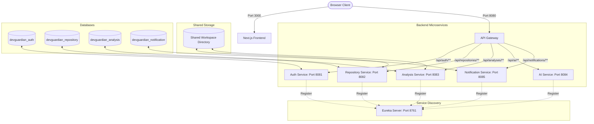

# DevGuardian - AI-Powered Code Security Cockpit

DevGuardian is a premium, state-of-the-art security analysis cockpit designed to automatically clone repositories, run static code analysis scans (for security, quality, and design vulnerabilities), and enrich detected issues with AI-generated explanations, impact analyses, and secure code mitigation templates.

---

## 🏗️ Architecture Overview

DevGuardian has been migrated from a legacy monolith into a modern, resilient **Spring Cloud Microservices Architecture** on the backend, paired with a dynamic **Next.js & TypeScript** frontend.



### 1. Backend Microservices
*   **Discovery Server (Eureka)** (`port 8761`): Central service registry where microservices register themselves on startup.
*   **API Gateway** (`port 8080`): The single entry point routing traffic from the client. Configured with a `DedupeResponseHeader` filter to prevent duplicate CORS headers from downstream services.
*   **Authentication Service** (`port 8081`): Manages user accounts, login validation, and generates secure JWT tokens.
*   **Repository Service** (`port 8082`): Interfaces with the GitHub API to list/import repositories and handles local git cloning via Eclipse JGit.
*   **Analysis Service** (`port 8083`): Executes static analysis rules on code files. Fires asynchronous scanning tasks via event listeners.
*   **AI Service** (`port 8084`): A stateless AI analyzer that consumes Groq and Gemini models to suggest explanations and patches for security findings.
*   **Notification Service** (`port 8085`): Manages user system notifications and unread badges.

### 2. Frontend Application
*   A premium React workspace built with **Next.js 16**, **TypeScript**, and styled with **Vanilla CSS** and customized theme variables.

---

## 🛠️ Key Technical Implementations

1.  **Thread-Local Context Propagation**: Outgoing Feign client requests originating from asynchronous `@Async` scanner threads automatically inherit the JWT `Authorization` header of the initiating servlet thread through a custom `ThreadLocal` wrapper in `FeignClientInterceptor`.
2.  **Shared Workspace Directory**: The Repository Service (cloning) and the Analysis Service (scanning) synchronize their file paths through a shared directory structure (`../workspace/repos`) relative to their execution directories.
3.  **CORS Deduplication**: Browser-side CORS errors are prevented by configuring the API Gateway to act as the single source of truth for cross-origin credentials, merging duplicate headers with the `RETAIN_LAST` strategy.

---

## ⚙️ Environment Configuration

Set the following environment variables on your system or inside your shell configuration before running the applications:

| Variable | Description | Default / Example |
| :--- | :--- | :--- |
| `POSTGRES_DB_USERNAME` | PostgreSQL database owner username | `postgres` |
| `POSTGRES_DB_PASSWORD` | PostgreSQL database owner password | `password` |
| `JWT_SECRET` | Secret key used to sign JWTs (min 32 bytes) | `yourjwtsecretkeystringmustbe32byteslong!!` |
| `GITHUB_CLIENT_ID` | OAuth App client ID from GitHub Developer console | `github_client_id` |
| `GITHUB_CLIENT_SECRET` | OAuth App client secret from GitHub Developer console | `github_client_secret` |
| `GROQ_API_KEY` | Groq API Key for LLM-based code diagnostics | `gsk_...` |
| `GEMINI_API_KEY` | Gemini API Key for fallback AI enrichment | `AIzaSy...` |

---

## 🐳 Running with Docker (Quickest & Easiest)

We have provided a fully containerized environment that configures the microservices, frontend, database, and message broker automatically.

### Prerequisites
*   Docker and Docker Compose installed.

### Step 1: Spin Up the Entire Stack
Navigate to the root directory (`d:/DevGuardian`) and run:
```bash
docker compose up -d --build
```
This single command will:
1. Initialize the PostgreSQL database container and automatically spin up the 4 required databases.
2. Spin up the RabbitMQ broker container.
3. Build and package all 7 backend Spring Boot services in multi-stage Java 21 containers.
4. Build and start the Next.js frontend container on port `3000`.

### Step 2: Verify Status
*   **Web Console Dashboard**: Open [http://localhost:3000](http://localhost:3000)
*   **Eureka Discovery Dashboard**: Open [http://localhost:8761](http://localhost:8761) to see all services registered.
*   **RabbitMQ Management Console**: Open [http://localhost:15672](http://localhost:15672) (User/Pass: `guest` / `guest`).

To shut down the environment, run:
```bash
docker compose down -v
```

---

## 🛠️ Local Development (Manual Setup)

If you are modifying code locally and prefer running services outside of Docker, follow these steps:

### Prerequisites
*   Java Development Kit (JDK) 21
*   Node.js v18+
*   PostgreSQL Database Server
*   Git command-line client

### Step 1: Database Setup
Create separate database schemas in your local PostgreSQL server matching the microservices:
```sql
CREATE DATABASE devguardian_auth;
CREATE DATABASE devguardian_repository;
CREATE DATABASE devguardian_analysis;
CREATE DATABASE devguardian_notification;
```

### Step 2: Spin Up the Backend Services
A pre-configured PowerShell orchestration script is located in the backend root directory. Run it to spin up all 7 backend instances in separate console windows:

```powershell
cd devguardian-backend
.\start-all.ps1
```

*Note: The script automatically starts the Eureka Server first, waits for registration services, and then spins up the Gateway, Core Services, AI, and Notification modules. If you need to build the JAR files, use `.\mvnw.cmd clean package -DskipTests`.*

### Step 3: Run the Frontend Application
In another terminal, navigate to the frontend directory and start the Next.js development server:

```bash
cd devguardian-frontend
npm install
npm run dev
```

Open [http://localhost:3000](http://localhost:3000) in your browser to access the DevGuardian dashboard!

---

## 🧪 Scanning a Repository
1.  **Register/Login**: Access the gateway authentication portal and create an account.
2.  **Import Repository**: Configure GitHub workspace access, select your target repository, and click import.
3.  **Trigger Cockpit Scan**: Click the "Trigger Cockpit Scan" button on the analysis interface. JGit will pull the codebase to the workspace directory, the analysis service will evaluate vulnerabilities, enrich them via the AI service, and notify you when the run status updates to `COMPLETED`!