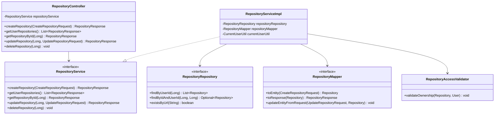
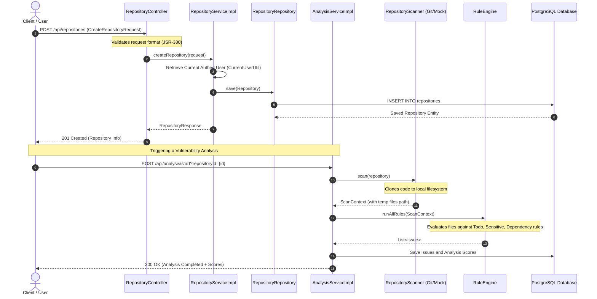

# DevGuardian Repository Module Workflow

The **Repository Module** is a core component of DevGuardian, responsible for managing, configuring, and securing Git repositories connected by users. It handles repository registration, metadata management, ownership verification, and serves as the primary data trigger for security analysis scans.

---

## 1. Class Architecture and Architecture Layers

The repository module is structured using clean architecture principles, separating REST presentation, business logic mapping, data access, and model representation layers.

### Key Components:
1. **[RepositoryController](file:///d:/DevGuardian/devguardian-backend/src/main/java/com/devguardian/repository/controller/RepositoryController.java)**:
   Exposes CRUD REST endpoints mapped under `/api/repositories` (`ApiEndpoints.REPOSITORIES`).
2. **[RepositoryService](file:///d:/DevGuardian/devguardian-backend/src/main/java/com/devguardian/repository/service/interfaces/RepositoryService.java)**:
   Defines capabilities of the repository domain.
3. **[RepositoryServiceImpl](file:///d:/DevGuardian/devguardian-backend/src/main/java/com/devguardian/repository/service/impl/RepositoryServiceImpl.java)**:
   Implements CRUD transactions and enforces user context matching.
4. **[RepositoryRepository](file:///d:/DevGuardian/devguardian-backend/src/main/java/com/devguardian/repository/repository/RepositoryRepository.java)**:
   Spring Data JPA repository interfacing with PostgreSQL.
5. **[RepositoryMapper](file:///d:/DevGuardian/devguardian-backend/src/main/java/com/devguardian/repository/mapper/RepositoryMapper.java)**:
   MapStruct processor for entity DTO mapping.
6. **[RepositoryAccessValidator](file:///d:/DevGuardian/devguardian-backend/src/main/java/com/devguardian/repository/util/RepositoryAccessValidator.java)**:
   Encapsulates repository resource-level authorization validation logic.

---

## 2. Database Schema and Entity Models

### Entities

#### A. Repository Entity (`repositories` table)
Represents a git repository linked to a user.
- **`id`** (`BIGINT`, PK, Auto-increment)
- **`name`** (`VARCHAR`, NOT NULL): User-friendly display name.
- **`url`** (`VARCHAR`, NOT NULL, UNIQUE): The clone or web URL of the Git repository.
- **`description`** (`VARCHAR(1000)`): Repository description.
- **`language`** (`VARCHAR`): Primary language (e.g. Java, Python, Go) dynamically identified or selected.
- **`branch`** (`VARCHAR`): Target branch to scan (e.g., `main`, `master`, `develop`).
- **`provider`** (`ENUM`): Source Git host. Allowed values: `GITHUB`, `GITLAB`, `BITBUCKET`, `OTHER`.
- **`visibility`** (`ENUM`): Security context. Allowed values: `PUBLIC`, `PRIVATE`, `INTERNAL`.
- **`status`** (`ENUM`): Lifecycle state. Allowed values: `ACTIVE`, `INACTIVE`, `SCANNING`.
- **`type`** (`ENUM`): Control style. Defaults to `GIT`.
- **`scanFrequency`** (`ENUM`): Periodic scanning frequency. Allowed values: `DAILY`, `WEEKLY`, `MONTHLY`, `MANUAL`.
- **`user_id`** (`BIGINT`, FK, NOT NULL): Identifies the owning `User`.
- **`createdAt`** (`TIMESTAMP`, NOT NULL): Automatically populated creation timestamp.

#### B. File Entity (`files` table)
Stores references to files scanned during a repository analysis.
- **`id`** (`BIGINT`, PK, Auto-increment)
- **`repository_id`** (`BIGINT`, FK, NOT NULL): The repository containing this file.
- **`fileName`** (`VARCHAR`, NOT NULL)
- **`filePath`** (`VARCHAR`, NOT NULL)
- **`uploadedAt`** (`TIMESTAMP`, NOT NULL)

---

## 3. Data Transfer Objects (DTOs)

- **[CreateRepositoryRequest](file:///d:/DevGuardian/devguardian-backend/src/main/java/com/devguardian/repository/dto/CreateRepositoryRequest.java)**:
  Used to register new repositories. Demands validated `@NotBlank` for `name` and `url`. Includes optional metadata: description, language, branch, provider, visibility, type, and scan frequency.
- **[UpdateRepositoryRequest](file:///d:/DevGuardian/devguardian-backend/src/main/java/com/devguardian/repository/dto/UpdateRepositoryRequest.java)**:
  Used to update attributes on existing repositories. Allows changes to name, description, language, branch, visibility, type, and scan frequency (protects provider and immutable URL).
- **[RepositoryResponse](file:///d:/DevGuardian/devguardian-backend/src/main/java/com/devguardian/repository/dto/RepositoryResponse.java)**:
  Exposes the database properties (including status, auto-generated ID, and creation date) to clients.

---

## 4. Complete End-to-End Workflow Flow

### Creation and Scan Activation Flow

The registration of a repository triggers subsequent analysis engines to fetch and evaluate code:

### Detailed Endpoint Workflows

1. **Create Repository** (`POST /api/repositories`)
   - Fetches context user using JWT token processing.
   - Maps DTO to entity via MapStruct.
   - Sets the user relationship and marks status to `ACTIVE`.
   - Saves record into database.

2. **List Repositories** (`GET /api/repositories`)
   - Resolves the authenticated user.
   - Queries `RepositoryRepository.findByUserId(userId)`.
   - Converts repositories list to `RepositoryResponse` list.

3. **Get Repository Details** (`GET /api/repositories/{id}`)
   - Retrieves repository using `repositoryRepository.findByIdAndUserId(id, userId)`.
   - Throws descriptive exception if missing or unauthorized.

4. **Update Repository** (`PUT /api/repositories/{id}`)
   - Queries and validates current ownership of repository.
   - Dynamically overwrites fields (excluding immutable connection elements).
   - Commits updates to the repository.

5. **Delete Repository** (`DELETE /api/repositories/{id}`)
   - Verifies ownership and access permissions.
   - Calls `repositoryRepository.delete(repository)`.
   - Cascades deleted entities down to children files and analysis logs.

---

## 5. Technology Stack and Configuration Dependencies

### Backend Technologies (`pom.xml`)

| Dependency | Purpose | Details |
|---|---|---|
| **Spring Boot Web Starter** | Core MVC controller framework and REST endpoints. | Spring Boot 3.5.14 |
| **Spring Data JPA & Hibernate** | Object-Relational mapping to manage the database schema. | Interfaced with PostgreSQL |
| **Spring Security & JWT** | Endpoint authorization; handles token validation and user mapping. | `jjwt-api`, `jjwt-impl` (v0.11.5) |
| **Spring Starter AMQP** | RabbitMQ integration for async background task execution. | Async queue processing |
| **MapStruct** | Fast compile-time generation of object mappers. | v1.5.5.Final |
| **Lombok** | Boilerplate reduction for entity models (Getters, Setters, Builders). | v1.18.34 |
| **PostgreSQL Driver** | RDBMS connector. | Runtime Dependency |
| **Spring Boot Validation Starter** | Validates incoming payloads (`@NotBlank`, `@Valid`). | JSR-380 |

### Frontend Components (`devguardian-frontend`)
- **Framework**: Next.js (TypeScript) utilizing App Router (`src/app/repositories/page.tsx`).
- **Interactive UI**: Modal elements (`Modal.tsx`), Forms (`Input.tsx`, `Button.tsx`), and Grid Cards (`RepositoryList.tsx`, `RepoCard.tsx`) designed with high-quality visual style overlays.
- **Mock integration state**: UI simulates adding and scanning flow using timeouts to provide feedback before full REST linkage.
